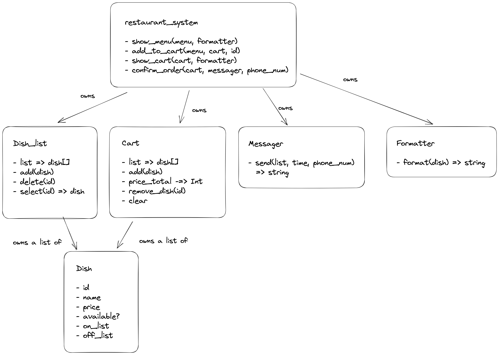

# Makers Week 1-2 : Solo Project - Restautrant System

## Overview

This is a solo project to test my golden square skills overall, including TTD by using `RSpec`, OOP by `Ruby` and mocking by `double` from `RSpec`. Only 4 user stories were given, and I had to design a system from scratch to cater for their needs.

- [Makers Week 1-2 : Solo Project - Restautrant System](#makers-week-1-2--solo-project---restautrant-system)
  - [Overview](#overview)
  - [User Stories](#user-stories)
  - [System Design Diagram](#system-design-diagram)
  - [Class Interface Design](#class-interface-design)
    - [Class: Restaurant System](#class-restaurant-system)
    - [Class: Dish List](#class-dish-list)
    - [Class: Cart](#class-cart)
    - [Class: Messager](#class-messager)
    - [Class: Formatter](#class-formatter)
    - [Class: Dish](#class-dish)
  - [Tests](#tests)
    - [Integration Test Design](#integration-test-design)
    - [Unit Test Design](#unit-test-design)
      - [Test: Restaurant System](#test-restaurant-system)
      - [Test: Dish List](#test-dish-list)
      - [Test: Cart](#test-cart)
      - [Test: Messager](#test-messager)
      - [Test: Formatter](#test-formatter)
      - [Test: Dish](#test-dish)
  - [Getting Started](#getting-started)
    - [1. Set up `Twilio` API Key in `.env`](#1-set-up-twilio-api-key-in-env)
    - [2. Install Dependencies](#2-install-dependencies)
    - [3. Start to Run](#3-start-to-run)
  - [Dependencies](#dependencies)

## User Stories

> As a customer  
> So that I can check if I want to order something  
> I would like to see a list of dishes with prices.
>
> As a customer  
> So that I can order the meal I want  
> I would like to be able to select some number of several available dishes.
>
> As a customer  
> So that I can verify that my order is correct  
> I would like to see an itemised receipt with a grand total.

## System Design Diagram

The diagram shows the entire structure of this system.



## Class Interface Design

Here is the list of class interface designs for this restaurant system.

### Class: Restaurant System

```ruby
# file: lib/restaurant_system.rb

class RestaurantSystem
  def initialize
    # ...
  end

  def show_menu(menu, formatter) # instances of DishList & Formatter
    # prints out the menu of this restaurant
    # => void
  end

  def add_to_cart(menu, cart, id) # instances of DishList & Cart, id is a string
    # selects a dish and adds it to the cart
    # => void
  end

  def show_cart(cart, formatter) # instances of Cart & Formatter
    # prints out all items in the cart
    # => void
  end

  def confirm_order(cart, messager) # instances of Cart & Messager
    # confirms an order by sending a message to customer
    # => void
  end
end

```

### Class: Dish List

```ruby
# file: lib/dish_list.rb

class DishList
  def initialize
    # ...
  end

  def list
    # shows all available dishes in this list
    # => returns a list of Dish objects
  end

  def add(dish) # dish is an instance of Dish
    # adds a dish to this list
    # => void
  end

  def delete(id) # id is a string
    # removes a dish from this list
    # => void
  end

  def select(id) # id is a string
    # selects a dish from this list
    # => returns a Dish object
  end
end

```

### Class: Cart

```ruby
# file: lib/cart.rb

class Cart
  def initialize
    # ...
  end

  def list
    # shows all items in the cart
    # => returns a list of Dish objects
  end

  def add(dish)
    # adds a dish to the cart
    # => void
  end

  def price_total
    # calculates the grand amount of all items in the cart
    # => returns an integer
  end

  def remove_dish(id) # id is a string
    # removes a dish from the cart
    # => void
  end

  def clear
    # removes all items in the cart
    # => void
  end
end

```

### Class: Messager

```ruby
# file: lib/messager.rb

class Messager
  def initialize
    # ...
  end

  def send(list, time = Time.now, phone_num = ENV["TEST_PHONE_NUM"]) # list is an array
    # sends a message to a mobile phone number
    # => returns a string of message body
  end
end

```

### Class: Formatter

```ruby
# file: lib/formatter.rb

class Formatter
  def initialize
    # ...
  end

  def format(dish) # dish is a instance of Dish
    # prints out the dish in a certain format
    # => string
  end
end

```

### Class: Dish

```ruby
# file: lib/dish.rb

class Dish
  def initialize(name, price) # name is a string, price is an integer
  end

  def id
    # returns the ID of this dish
    # => string
  end

  def name
    # returns the name of this dish
    # => string
  end

  def price
    # returns the price of this dish
    # => integer
  end

  def available?
    # returns if this dish is available
    # => boolean
  end

  def on_list
    # make this dish available on the list
    # => void
  end

  def off_list
    # make this dish unavailable on the list
    # => void
  end
end

```

## Tests

You can run all the tests by running `rspec` in this folder.

### Integration Test Design

```ruby
# file: spec/restaurant_system_integration_spec.rb

# 1
dish = Dish.new("Curry chicken with rice", 15)
menu = DishList.new
formatter = Formatter.new
menu.add(dish)
restaurant_system = RestaurantSystem.new
restaurant_system.show_menu(menu, formatter)
# => Menu
#    ------------
#    - Curry chicken with rice: $15

# 2
menu = DishList.new
formatter = Formatter.new
restaurant_system = RestaurantSystem.new
restaurant_system.show_menu(menu, formatter) # => 'This list is empty.'

# 3
dish = Dish.new("Curry chicken with rice", 15)
menu = DishList.new
cart = Cart.new
formatter = Formatter.new
restaurant_system = RestaurantSystem.new
restaurant_system.add_to_cart(menu, cart, dish.id)
restaurant_system.show_cart(cart, formatter)
# => Cart
#    ------------
#    - Curry chicken with rice: $15
#    ------------
#    Grand total : $15

# 4
dish = Dish.new("Curry chicken with rice", 15)
cart = Cart.new
messager = Messager.new
restaurant_system = RestaurantSystem.new
restaurant_system.confirm_order(cart, messager, "+447775599444") # => 'Your order is confirmed. Thank you for your order'

```

### Unit Test Design

#### Test: Restaurant System

```ruby
# file: spec/restaurant_system_spec.rb

# 1
dish = double :fake_dish, name: "Curry chicken with rice", price: 15
menu = double :fake_menu
formatter = double :fake_formatter
expect(menu).to receive(:list).and_return([dish]).ordered
expect(formatter).to receive(:format).with([dish]).and_return("- Curry chicken with rice: $15").ordered
restaurant_system = RestaurantSystem.new
restaurant_system.show_menu(menu, formatter)
# => Menu
#    ------------
#    - Curry chicken with rice: $15

# 2
menu = double :fake_menu
formatter = double :fake_formatter
expect(menu).to receive(:list).and_return([]).ordered
expect(formatter).to receive(:format).with([]).and_return("The list is empty.").ordered
restaurant_system = RestaurantSystem.new
restaurant_system.show_menu(menu, formatter) # => 'This list is empty.'

# 3
dish = double :fake_dish, id: "fake-id", name: "Curry chicken with rice", price: 15
menu = double :fake_menu
cart = double :fake_cart
formatter = double :fake_formatter
expect(menu).to receive(:select).with("fake-id").and_return(dish).ordered
expect(cart).to receive(:add).with(dish).ordered
expect(cart).to receive(:list).and_return([dish]).ordered
expect(formatter).to receive(:format).with([dish]).and_return("- Curry chicken with rice: $15").ordered
expect(cart).to receive(:price_total).and_return(15).ordered
restaurant_system = RestaurantSystem.new
restaurant_system.add_to_cart(menu, cart, "fake-id")
restaurant_system.show_cart(cart, formatter)
# => Cart
#    ------------
#    - Curry chicken with rice: $15
#    ------------
#    Grand total : $15

# 4
dish = double :fake_dish
cart = double :fake_cart
messager = double :fake_messager
expect(cart).to receive(:list).and_return([dish])
expect(messager).to receive(:send).with("+447775599444").and_return("accepted")
expect(cart).to receive(:clear)
restaurant_system = RestaurantSystem.new
restaurant_system.confirm_order(cart, messager, "+447775599444") # => 'Your order is confirmed. Thank you for your order'
```

#### Test: Dish List

```ruby
# file: spec/dish_list_spec.rb

# 1
dish = double :fake_dish
dish_list = DishList.new
dish_list.add(dish)
dish_list.list() # => [<Dish #0001>]

# 2
dish_list = DishList.new
dish_list.list() # => []

# 3
dish = double :fake_dish, id: "fake-id"
dish_list = DishList.new
dish_list.add(dish)
dish_list.delete("fake-id")
dish_list.list() # => []

# 4
dish = double :fake_dish, id: "fake-id"
dish_list = DishList.new
dish_list.add(dish)
dish_list.delete("wrong-id") # => throw an error with message "Invalid id. Please enter again."

# 5
dish = double :fake_dish, id: "fake-id"
dish_list = DishList.new
dish_list.add(dish)
dish_list.select("fake-id") # => <Dish #0001>

```

#### Test: Cart

```ruby
# file: spec/cart_spec.rb

# 1
dish = double :fake_dish
cart = Cart.new
cart.add(dish)
cart.list() # => [<Dish #0001>]

# 2
cart = Cart.new
cart.list() # => []

# 3
dish = double :fake_dish, price: 15
cart = Cart.new
cart.add(dish)
cart.add(dish)
cart.price_total() # => 30

# 4
dish = double :fake_dish, id: "fake-id"
cart = Cart.new
cart.add(dish)
cart.remove_dish("fake-id")
cart.list # => []

# 5
dish = double :fake_dish, id: "fake-id"
cart = Cart.new
cart.add(dish)
cart.remove_dish("wrong-id") # => throw an error with message "Invalid id. Please enter again."

# 6
dish = double :fake_dish
cart = Cart.new
cart.add(dish)
cart.add(dish)
cart.clear
cart.list() # => []

```

#### Test: Messager

```ruby
# file: spec/messager_spec.rb

# 1
dish = double :fake_dish
cart = double :fake_cart
fake_time = Time.new(2023, 1, 25, 18, 20 ,0)
expect(cart).to receive(:list).and_return([dish, dish])
messager = Messager.new
messager.send(cart.list, fake_time) # => "Thank you! Your order was placed and will be delivered before 18:40"

```

#### Test: Formatter

```ruby
# file: spec/formatter_spec.rb

# 1
dish = double :fake_dish, name: "Curry chicken with rice", price: 15
formatter = Formatter.new
formatter.format(dish) # => - Curry chicken with rice: $15


```

#### Test: Dish

```ruby
# file: spec/dish_spec.rb

# 1
dish = Dish.new("Curry chicken with rice", 15)
dish.id() #=> "2d931510-d99f-494a-8c67-87feb05e1594"

# 2
dish = Dish.new("Curry chicken with rice", 15)
dish.name() #=> "Curry chicken with rice"

# 3
dish = Dish.new("Curry chicken with rice", 15)
dish.price() #=> 15

# 4
dish = Dish.new("Curry chicken with rice", 15)
dish.available?() #=> true

# 5
dish = Dish.new("Curry chicken with rice", 15)
dish.off_list
dish.available?() #=> false

# 6
dish = Dish.new("Curry chicken with rice", 15)
dish.off_list
dish.on_list
dish.available?() #=> true


```

## Getting Started

### 1. Set up `Twilio` API Key in `.env`

You must have an acoount in [Twilio](https://www.twilio.com/login) in order to run this project. Please create a `.env` inside this folder and replace the below temaplate with your own tokens.

```sh
TWILIO_ACCOUNT_SID="your_test_account_sid" # please visit www.twilio.com/console/settings
TWILIO_AUTH_TOKEN="your_auth_token"
TWILIO_MESSAGING_SERVICE_SID="your_messageing_service_sid"
TEST_PHONE_NUM="your_phone_num"
```

### 2. Install Dependencies

By running `bundle`, all dependencies you need for this project will be installed locally.

### 3. Start to Run

You can start the project by running `ruby lib/restaurant_system.rb`

## Dependencies

- Ruby 3.0.0 ([website](https://www.ruby-lang.org/en/))
- RSpec 3.12 ([website](https://rspec.info/))
- twilio-ruby 5.74.1 ([Github](https://github.com/twilio/twilio-ruby))
